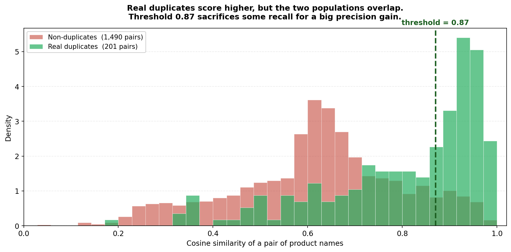
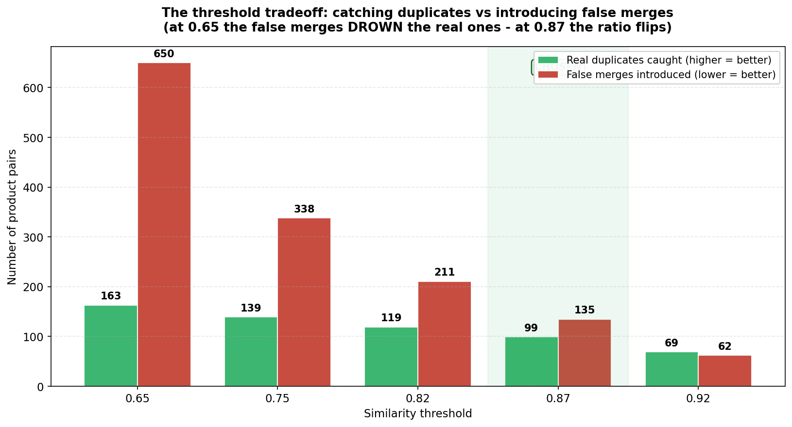
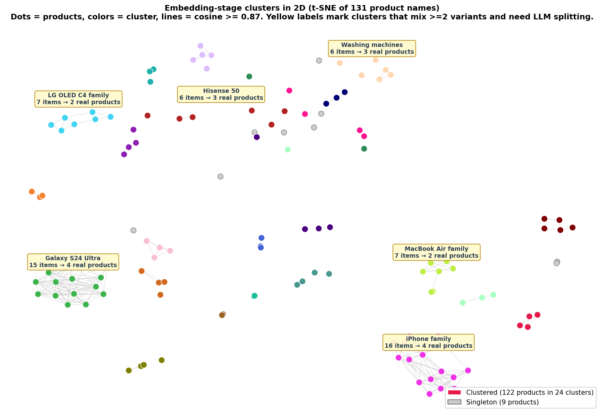
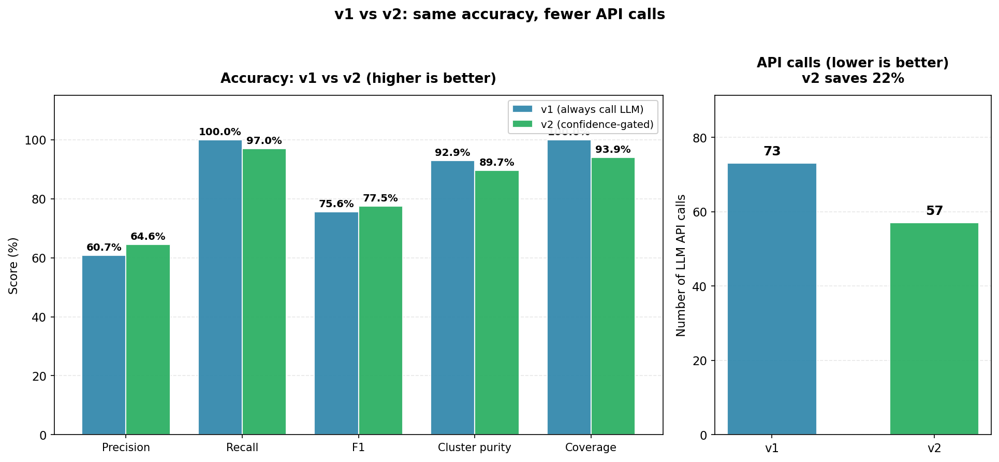

# פרויקט דה-דופליקציה של מוצרים ואיחוד מחירים - מרשימה מבולגנת לקטלוג מאוחד

> מסמך אחד שמכיל את כל תהליך החשיבה של הפרויקט, מהמסגור של הבעיה ועד לפלט הסופי.
> זוהי גרסת ההרחבה של [APPROACH.md](APPROACH.md) הקצר - אותו חומר, אבל עם
> היסטוריית האיטרציות, דוגמאות מלאות, גרפים ומטריקות מלאות.
>
> **איך לקרוא את המסמך:**
>
> - אם צריך רק את גרסת ההגשה הקצרה: [APPROACH.md](APPROACH.md).
> - אם רוצים לראות את תהליך ההחלטה המלא, הבאגים והאיטרציות: המשך כאן.
> - אלא אם צוין אחרת, המטריקות כאן הן מריצה מייצגת; ה-`LLM` מוסיף שונות קלה בין ריצות.

---

## 1. הבעיה

הניסוח של המשימה הוא פסקה אחת:

> מקבלים רשימת מוצרים עם כפילויות ושמות לא עקביים (לדוגמה, `Samsung S23` ו-`סמסונג גלקסי S23`).
> צריך לכתוב סקריפט שמאחד את הכפילויות ומבטיח שהמחיר הזול ביותר מוצג ללקוח.

זה הכל. אבל יש שלושה דברים שמסתתרים בתוך הפסקה הזאת:

1. **התאמה בין שפות.** הדאטה ריאליסטי לאי-קומרס ישראלי, מה שאומר ששמות המוצרים
   מערבבים עברית, אנגלית וצורות תעתיק - לפעמים שלושתן עבור אותו מוצר.
2. **אי-עקביות בשמות.** מוכרים שונים משתמשים בקיצורים שונים, משמיטים את המותג,
   כותבים `256 GB` מול `256GB` מול `256 ג'יגה`, או מוסיפים מספרי דגם שאף אחד אחר
   לא משתמש בהם. שום דבר מזה לא משקף הבדל אמיתי במוצר.
3. **איחוד מחירים.** ברגע שיודעים אילו רישומים הם כפילויות - החלק הקל: להציף את
   הזול ביותר. כל העבודה היא בשני הסעיפים הראשונים.

## 2. מסגור הגישה

יש שלוש דרכים כנות לתקוף את הבעיה הזאת:

**אפשרות א' - `LLM` בלבד.** להעביר אצוות של מוצרים ל-`LLM` ולבקש ממנו לקבץ כפילויות.
מטפל בעברית/אנגלית באופן טבעי, מבין סמנטיקה של מוצרים. אבל יקר בקנה מידה גדול,
איטי, מוגבל בקצב, ולא דטרמיניסטי. לא ישים לקטלוג אמיתי עם מיליוני מוצרים.

**אפשרות ב' - `embeddings` וקלאסטרינג בלבד.** לייצר וקטורי `embedding` לשמות
המוצרים, לקבץ לפי דמיון קוסיני, ולאחד. מתאים לקנה מידה ומהיר - אבל התאמת דמיון
טהורה מפספסת ניואנסים סמנטיים. ה-`embeddings` ישמחו לאחד את `Galaxy S25` עם
`Galaxy S25 FE` כי המחרוזות נראות כמעט זהות, למרות שמדובר במוצרים שונים במחירים שונים.

**אפשרות ג' - היברידית (`embeddings` יחד עם שיפור `LLM`).** משתמשים ב-`embeddings`
לקיבוץ ראשוני של מועמדים (מהיר, סקיילבילי, חינם), ואז קוראים ל-`LLM` רק על המקרים
המעורפלים ששלב ה-`embeddings` לא הצליח להכריע לבד. מקבלים את הטוב משני העולמות:
פילטר סקיילבילי, וגומר אינטליגנטי.

הפרויקט הזה הולך עם **אפשרות ג'**, וכל שאר המסמך עוסק בלמה ה-`pipeline` ההיברידי
נראה בסוף בדיוק כמו שהוא נראה.

ההיגיון מאחורי בחירת הגישה ההיברידית משקף איך הבעיה הזאת תיפתר באמת בקנה המידה של
זאפ. אי אפשר לשלוח מיליוני מוצרים ל-`LLM`. התאמת דמיון טהורה מפספסת הבנה סמנטית.
`pipeline` בשני שלבים נותן מהירות איפה שצריך אותה (סינון ראשוני) ואינטליגנציה
איפה שצריך אותה (החלטות סופיות).

**ה-`stack` במבט אחד:**

- **שפה:** `Python`.
- **הטמעות (`Embeddings`):** `sentence-transformers` עם המודל הרב-לשוני
  `paraphrase-multilingual-mpnet-base-v2`. חינם, רץ מקומית, בלי תלות ב-`API`.
- **שיפור `LLM`:** `OpenAI gpt-4o-mini`. זול, פלט `JSON` יציב, עברית טובה.
  המימוש אגנוסטי למודל באמצעות שתי פונקציות עזר, כך שהחלפה ל-`Claude` או
  `Gemini` היא שינוי בקובץ אחד.
- **דאטה:** דאטהסט סינתטי שמודל לפי דפוסים אמיתיים מ-`zap.co.il`.

## 3. הדאטהסט

הדאטהסט הוא במכוון **סינתטי**, לא מגורד. זה ראוי להסבר כי זו החלטה מודעת ולא
עצלנות.

שקלתי לגרד מוצרים ישירות מ-`zap.co.il`, אבל החלטתי שלא - משלוש סיבות:

1. **הניסוח של המשימה אומר "קיבלת רשימת מוצרים".** הדאטה הוא הקלט, לא משהו שצריך
   להביא. האתגר הוא בלוגיקת הדה-דופליקציה, לא באיסוף הדאטה.
2. **גישה מכבדת.** לגרד את אתר הייצור של מעסיק פוטנציאלי בלי רשות מפורשת זו לא
   המהלך הנכון, גם אם זה אפשרי טכנית.
3. **מקרי קצה מבוקרים.** דאטה סינתטי מאפשר לי לכלול במכוון כל תרחיש מסובך שאני
   רוצה שהמערכת תטפל בו - ערבוב עברית/אנגלית, קיצורים, השמטות מותג, התאמות-קרובות
   שאסור לאחד - הכל בקובץ אחד קטן שאפשר לעבור עליו בעיניים.

### למה דאטהסט קטן ומבוקר - ולא 1,000 מוצרים

שלוש סיבות.

- **בר-בקרה.** מי שמעריך את הפרויקט יכול לוודא ידנית שה-`pipeline` עושה את הדבר
  הנכון. עם 1,000 מוצרים נשאר רק לסמוך על המטריקות.
- **מציג את כל מקרי הקצה.** 131 רישומים הם די והותר כדי לדחוס פנימה כל דפוס כפילויות
  שאני רוצה לטפל בו.
- **איטרציה מהירה.** ה-`pipeline` רץ בשניות. אפשר לדבג, להדגים ולהריץ מחדש כמה
  פעמים שצריך בלי לחכות.

הסקיילביליות היא **ארכיטקטונית, לא בכוח גס**. במילים אחרות:
_"נבדק על 131 רישומים, הארכיטקטורה תוכננה למיליונים."_ שלב ה-`embeddings` הוא
`O(n)` ועוד `O(n²)` בדמיון בזוגות (ניתן להחלפה ב-`FAISS`/`ANN` בקנה מידה גדול),
ושלב ה-`LLM` נוגע רק במקרי הקצה המעורפלים - כך שהעלות גדלה לינארית ב*עמימות*,
לא בסך הרישומים.

### מה הגיע בסוף לקובץ

דאטהסט סינתטי (`data/products.csv`) עם:

- **131 רישומים** שנוצרו מ-**33 מוצרים קנוניים ייחודיים**
- **6 קטגוריות** (טלפונים, טלוויזיות, אוזניות, לפטופים, מכונות כביסה, טאבלטים)
- 3-5 וריאציות שם לכל מוצר קנוני, מחירים אקראיים
- השורות מעורבלות כך שכפילויות לא נמצאות זו לצד זו - בדיוק כמו דאטה אמיתי מבולגן

| קטגוריה       | מוצרים ייחודיים | סך הרישומים |
| ------------- | :-------------: | :---------: |
| סלולר         |       11        |     ~45     |
| טלוויזיות     |        5        |     ~21     |
| אוזניות       |        6        |     ~22     |
| מחשבים ניידים |        5        |     ~21     |
| מכונות כביסה  |        3        |     ~12     |
| טאבלטים       |        3        |     ~12     |

נכללו מספר קטגוריות במכוון - כדי להראות שהפתרון מכליל, לא רק לטלפונים. זאפ מנהלת
עשרות תחומים.

### מקרי קצה שהוכנסו במכוון לקובץ

**כפילויות שהמערכת חייבת לאחד:**

- כפילויות עברית/אנגלית: `Samsung Galaxy S24 Ultra 256GB` מול
  `סמסונג גלקסי S24 אולטרה 256GB`
- שמות חלקיים שחסר בהם המותג: `Galaxy S25 256GB` מול `Samsung Galaxy S25 256GB`
- קיצורים: `Samsung S24 Ultra` מול `Samsung Galaxy S24 Ultra`
- מספרי דגם מול שמות שיווקיים: `Samsung UE55DU7100 Crystal UHD` מול
  `Samsung 55" Crystal UHD 4K`
- מותגים מתועתקים: `ג'יי בי אל` (`JBL`), `שיאומי` (`Xiaomi`), `בוש` (`Bosch`)
- יחידות שכתובות אחרת: `256GB` מול `256 GB` מול `256 ג'יגה`
- הבדלי `case`: `SAMSUNG Galaxy S24` מול `Samsung Galaxy S24`

**התאמות-קרובות שהמערכת אסור שתאחד** (אלה בודקות `precision`):

- אחסון שונה: `Samsung Galaxy S24 Ultra 256GB` מול `512GB`
- וריאנט דגם שונה: `Samsung Galaxy S25` מול `Galaxy S25 FE`
- דגם שונה: `Apple iPhone 16 Pro Max` מול `iPhone 16 Pro`
- דור שונה: `Sony WH-1000XM5` מול `WH-1000XM4`
- גודל מסך שונה: `LG OLED C4 65"` מול `55"`
- קונפיגורציית אחסון שונה: `MacBook Air M3 256GB` מול `512GB`
- קו מוצר שונה לחלוטין: `AirPods Pro 2` מול `AirPods 4`

המקרים של "אסור לאחד" חשובים בדיוק כמו הכפילויות - הם בודקים שהמערכת לא מקבצת
באגרסיביות מוצרים שנשמעים דומים אבל הם באמת שונים.

## 4. בחירת המודלים

ה-`pipeline` ההיברידי דורש שני מודלים, כל אחד מסוג שונה.

### שלב 1: מודל ה-`embedding`

הדרישה המרכזית: **תמיכה רב-לשונית חזקה** לעברית ואנגלית.

| מודל                                    | עלות           | תמיכה בעברית | איכות     | הערות                                |
| --------------------------------------- | -------------- | ------------ | --------- | ------------------------------------ |
| `paraphrase-multilingual-MiniLM-L12-v2` | חינם (מקומי)   | טובה         | טובה      | 384 ממדים, מהיר, קל                  |
| `paraphrase-multilingual-mpnet-base-v2` | חינם (מקומי)   | טובה מאוד    | טובה מאוד | 768 ממדים, איכות טובה יותר, כבד יותר |
| `OpenAI text-embedding-3-small`         | `$0.02/1M tok` | טובה מאוד    | טובה מאוד | תלוי `API`                           |
| `OpenAI text-embedding-3-large`         | `$0.13/1M tok` | מצוינת       | מצוינת    | אוברקיל למשימה הזאת                  |

**נבחר: `paraphrase-multilingual-mpnet-base-v2`.** חינם ומקומי, בלי מפתח `API`,
בלי מגבלות קצב, בלי עלות. תמיכה רב-לשונית חזקה ביותר מ-50 שפות כולל עברית.
768 ממדים זה איכות מספיקה לדמיון סמנטי. יחס עלות-תועלת מצוין (חינם פשוטו כמשמעו)
ברמת ייצור.

### שלב 2: ה-`LLM`

הדרישות המרכזיות: **חשיבה טובה, עברית טובה, יעיל בעלות**. ה-`LLM` רואה רק מקרים
מעורפלים, אבל הנפח עדיין משחק בקנה מידה.

תמונת מחירים נכון לאפריל 2026, מהדפים הרשמיים של כל ספק:

| מודל                    | קלט        | פלט         | עברית     | הערות                               |
| ----------------------- | ---------- | ----------- | --------- | ----------------------------------- |
| `GPT-5-nano`            | `$0.05/1M` | `$0.40/1M`  | טובה      | האפשרות הזולה ביותר ב-`OpenAI`      |
| `Gemini 2.5 Flash-Lite` | `$0.10/1M` | `$0.40/1M`  | טובה      | הזולה ביותר באופן כללי, מהירה מאוד  |
| `GPT-4.1-nano`          | `$0.10/1M` | `$0.40/1M`  | טובה      | שווה ל-`Gemini Flash-Lite`          |
| **`GPT-4o-mini`**       | `$0.15/1M` | `$0.60/1M`  | טובה      | יותר ישן אבל מנוסה, מצב `JSON` יציב |
| `GPT-5-mini`            | `$0.25/1M` | `$2.00/1M`  | טובה מאוד | קפיצה ביכולת חשיבה                  |
| `Gemini 2.5 Flash`      | `$0.30/1M` | `$2.50/1M`  | טובה מאוד | מודל איכותי לכל מטרה                |
| `Claude Haiku 4.5`      | `$1.00/1M` | `$5.00/1M`  | טובה מאוד | העברית הטובה ביותר בשורה הזולה      |
| `Claude Sonnet 4.6`     | `$3.00/1M` | `$15.00/1M` | מצוינת    | אוברקיל                             |

**נבחר: `GPT-4o-mini`.** ולידציית קלאסטרים כאן היא משימת השוואה מובנית - "האם
אלה אותו מוצר?" - לא משהו שדורש חשיבה מהדור החזיתי. שמות מוצרים בעברית קצרים
וחד-משמעיים מספיק כך ש-`4o-mini` מטפל בהם באופן אמין. שלב ה-`LLM` רואה רק ~24
קלאסטרים מועמדים ועוד 9 סינגלטונים, כך שהעלות הכוללת לריצה היא חלקיקי סנט.
ול-`4o-mini` יש היסטוריה ארוכה יותר של פלט `JSON` יציב מאשר למודלי ה-`nano`
הזולים יותר, מה שחשוב יותר מאשר לחסוך `$0.001`.

הקוד תוכנן באופן אגנוסטי-למודל - שתי פונקציות עזר (`split_cluster_with_llm`
ו-`match_singleton_with_llm`) הן המקומות היחידים שנוגעים בלקוח של `OpenAI`.
החלפת ספק היא שינוי בקובץ אחד.

### הערכת עלות

עבור הדאטהסט הנוכחי (131 רישומים):

- **הטמעות (`Embeddings`):** `$0` (רץ מקומית)
- **קריאות `LLM`:** ~50 ולידציות קלאסטר × ~200 טוקנים לכל אחת = ~`10K` טוקנים
  → עלות ב-`4o-mini`: **פחות מ-`$0.01`**
- **סך הכל לריצה: בעצם חינם.**

בקנה המידה של זאפ (מיליוני מוצרים), שלב ה-`embeddings` נשאר חינם בלי קשר לגודל
הקטלוג. עלות ה-`LLM` גדלה לינארית רק עם מספר הקלאסטרים ה*מעורפלים*, שהוא מספר
הרבה יותר קטן מסך המוצרים.

## 5. ארכיטקטורת ה-`pipeline`

```
┌─────────────────────────────────────────────────────────────────┐
│  INPUT: products.csv (131 messy product listings)               │
│                                                                 │
│  - columns: product_id, product_name, price, category           │
│  - 6 categories: mobile, headphones, TVs, laptops, etc.         │
│  - same product appears as Hebrew/English/model-code variants   │
│  - prices differ; target one row per real product with min price│
└─────────────────┬───────────────────────────────────────────────┘
                  │
                  ▼
┌─────────────────────────────────────────────────────────────────┐
│  STAGE 1: EMBEDDINGS   (src/embeddings.py)                      │
│                                                                 │
│  - model: paraphrase-multilingual-mpnet-base-v2                 │
│  - embed every product_name with this multilingual model        │
│  - compare only products from the same category                 │
│  Pass 1 - pairwise within each category at sim ≥ 0.87           │
│           Build clusters via union-find on the pair graph       │
│  Pass 2 - assign leftover singletons to cluster centroids       │
│           at sim ≥ 0.65 (centroids are more stable)             │
│                                                                 │
│  Output: 24 candidate clusters + 9 leftover singletons          │
│  Meaning: candidate groups, not final truth yet                 │
│  Goal:   HIGH RECALL - catch duplicates, allow false positives  │
└─────────────────┬───────────────────────────────────────────────┘
                  │
                  ▼  (24 candidate clusters + 9 leftover singletons)
┌─────────────────────────────────────────────────────────────────┐
│  STAGE 2: LLM REFINEMENT v2   (src/llm_refine_v2.py)            │
│                                                                 │
│  - not every product/pair is sent to GPT                        │
│  - API helpers live in src/llm_refine.py                        │
│  Cheap gates decide when GPT-4o-mini is needed:                 │
│                                                                 │
│  Pass 1 - SPLIT: gated by variant-token agreement               │
│           If variant tokens disagree, do NOT split automatically│
│           call split_cluster_with_llm(...)                      │
│           GPT-4o-mini decides whether/how to split              │
│           LLM returns JSON groups of true duplicates            │
│                                                                 │
│  Pass 2 - MATCH: gated by centroid similarity                   │
│           If singleton -> centroid sim ≥ 0.85: auto-merge       │
│           Else call match_singleton_with_llm(...)               │
│           LLM returns matched group number or null              │
│                                                                 │
│  Pass 3 - MERGE: gated by centroid distance + sibling guard     │
│           If cluster centroids are close and not siblings:      │
│           call match_singleton_with_llm(...) to confirm merge   │
│                                                                 │
│  Output: ~30 final clusters, 0 unmatched singletons             │
│  Goal:   HIGH PRECISION - only merge real duplicates            │
│  v1 (always-LLM) lives in src/llm_refine.py for comparison      │
└─────────────────┬───────────────────────────────────────────────┘
                  │
                  ▼
┌─────────────────────────────────────────────────────────────────┐
│  STAGE 3: PRICE CONSOLIDATION   (src/deduplicator.py)           │
│                                                                 │
│  - no AI here; duplicate decisions are already done             │
│  For each final cluster:                                        │
│    - pick the canonical name (longest in the cluster)           │
│    - min_price, max_price, savings_pct                          │
│    - num_listings + original listing_ids for traceability       │
└─────────────────┬───────────────────────────────────────────────┘
                  │
                  ▼
┌─────────────────────────────────────────────────────────────────┐
│  OUTPUT: deduplicated_products.csv (~30 unified products)       │
│          + deduplicated_products.audit.json                     │
│                                                                 │
│  - CSV is the final catalog: one row per real product           │
│  - audit JSON explains auto decisions and GPT-reviewed cases    │
└─────────────────────────────────────────────────────────────────┘
```

### למה ה-`embeddings` באים קודם

שלוש סיבות, לפי סדר חשיבות:

1. **ה-`embeddings` הם הפילטר.** לשלוח כל מוצר ל-`LLM` יהיה `O(n²)` קריאות -
   8,500 זוגות בדאטהסט הקטן הזה, ו-`10¹²` בקטלוג אמיתי של זאפ. ה-`embeddings`
   חותכים את זה לקומץ קלאסטרים מועמדים שה-`LLM` באמת צריך להסתכל עליהם.
2. **בלי תלות ב-`API`.** מודל ה-`embedding` רץ מקומית. אפשר לאיתר, לדבג ולכוונן
   ספים בלי לשרוף קרדיטים או להיתקל במגבלות קצב.
3. **זה הבסיס.** אם שלב ה-`embeddings` מפספס כפילות, ה-`LLM` לעולם לא יקבל
   הזדמנות לתפוס אותה. לכן שלב 1 מכוון ל-**`recall` גבוה** - עדיף לאחד יותר מדי
   ולתת ל-שלב 2 לפצל, מאשר לפספס כפילות אמיתית לתמיד.

### למה `connected components`

אחרי חישוב הדמיון בזוגות, מקבצים מוצרים בעזרת גרף: כל מוצר הוא צומת, קשת מחברת
שני מוצרים אם הדמיון שלהם מעל הסף, וה-**`connected components`** הופכים
לקלאסטרים.

זה מטפל בשרשראות כמו
`Samsung Galaxy S24 Ultra` ↔ `Galaxy S24 Ultra 256GB` ↔ `סמסונג גלקסי S24 אולטרה 256GB`
שבהן שני הקצוות אולי לא דומים מספיק זה לזה ישירות, אבל מחוברים דרך מוצר אמצעי.
**סינון לפי קטגוריה** מונע שרשראות חוצות-קטגוריות - לעולם לא משווים טלפון ללפטופ,
גם אם הם חולקים את הטוקן `256GB`.

## 6. שלב 1 - `Embeddings`

שלב ה-`embeddings` לא היה חד-פעמי. נדרשו חמש איטרציות כדי להגיע לעיצוב הנוכחי.

### מסע הסף

| ניסיון |  סף  | סינון לפי קטגוריה? | `Pass 2`? | תוצאה                                                             |
| :----: | :--: | :----------------: | :-------: | ----------------------------------------------------------------- |
|   1    | 0.65 |         לא         |    לא     | 1,221 זוגות, **2 קלאסטרים** - גוש ענק אחד של 127 פריטים           |
|   2    | 0.82 |         לא         |    לא     | 362 זוגות, 15 קלאסטרים - אבל קלאסטר 1 כלל 53 פריטים חוצי קטגוריות |
|   3    | 0.82 |         כן         |    לא     | 330 זוגות, 18 קלאסטרים - קלאסטר הטלפונים עדיין כלל 35 פריטים      |
|   4    | 0.87 |         כן         |    לא     | 234 זוגות, 24 קלאסטרים + **29 סינגלטונים (פספוס 22%)**            |
|   5    | 0.87 |         כן         |    כן     | 234 זוגות, 24 קלאסטרים + **9 סינגלטונים (פספוס 7%)** ← הסופי      |

כל שלב לימד משהו:

- **0.65 הוא נמוך מדי בהרבה.** שמות מוצרים חולקים כל כך הרבה אוצר מילים בסיסי
  (מותגים, נפחי אחסון, "אינץ'") שהכל משתרשר.
- **בלי סינון לפי קטגוריה זה קטלני.** טלפון עם `256GB` מתחבר ללפטופ עם `256GB`
  דרך טאבלט, ועכשיו יש קלאסטר אחד של 53 פריטים חוצי-קטגוריות.
- **0.87 זה הטווח הנכון.** הוא מייצר קלאסטרים נקיים של 2-16 פריטים, אבל משאיר 29
  שמות קשים כיתומים. חלקם תעתיקים/תרגומים עבריים, אבל לא כולם: יש גם שמות
  `model-code heavy` כמו `Samsung WW80T534 8kg` או `Bosch WAX32M40 9kg`.
  הם נופלים כי יש בהם הרבה מספרי דגם, מעט מילים סמנטיות, ולעיתים אין חפיפה
  טובה מול השם המלא או העברי של אותו מוצר.
- **מעבר שני על סנטרואידים מתקן את היתומים.** סנטרואידים הם ה*ממוצע* של
  ה-`embeddings` בקלאסטר - הרבה יותר יציבים מכל חבר בודד, אז בטוח להשתמש בסף
  נמוך יותר (0.65) בלי בעיות השרשור של `Pass 1`.

### למה בחרנו 0.87 - מסתכלים על האמת היסודית

מכיוון שהדאטהסט סינתטי, אני יודע בדיוק אילו זוגות שמות הם כפילויות אמיתיות (הם
הגיעו מאותו מוצר קנוני ב-`generate_dataset.py`) ואילו לא. זה מאפשר לתייג כל זוג
בתוך-קטגוריה ככפילות או לא-כפילות, ולהסתכל איפה כל קבוצה נופלת על סקלת הדמיון.



הרעיון בבחירת הסף היה למצוא איפה הרווח בכפילויות האמיתיות שנשארות מימין לקו
מצדיק את המחיר של הלא-כפילויות שגם עוברות אותו. רק סביב `0.87` ומעלה מתחילים
לראות פער משמעותי לטובת הירוק על האדום, ולכן שם משתלם להעביר את הסף.

בפשטות: רוב הירוקים נמצאים ימינה, כלומר כפילויות אמיתיות בדרך כלל מקבלות
דמיון גבוה; רוב האדומים נמצאים שמאלה, כלומר לא-כפילויות בדרך כלל מקבלות דמיון
נמוך. הבעיה היא שיש חפיפה באמצע, ולכן אין סף מושלם. סף נמוך מדי כמו `0.65`
תופס הרבה ירוקים אבל גם המון אדומים ויוצר קלאסטרים מלוכלכים. סף גבוה מדי כמו
`0.92` נקי יותר, אבל מפספס יותר מדי כפילויות. `0.87` הוא הפשרה: מספיק גבוה
כדי להשאיר הרבה אדומים בחוץ, ועדיין מספיק נמוך כדי לבנות קלאסטרים מועמדים
שאת השאריות שלהם `Pass 2` וה-`LLM` יכולים להציל.

יש 1,691 זוגות בתוך-קטגוריות בדאטהסט: 201 כפילויות אמיתיות (ירוק) ו-1,490
לא-כפילויות (אדום). הגרף מראה את הצפיפות של כל אוכלוסייה לפי ציון הדמיון הקוסיני.
שני דברים שכדאי לשים לב אליהם:

1. שתי ההתפלגויות חופפות מאוד בטווח 0.65-0.90. אין פער נקי. סף יחיד לא יכול להיות
   מושלם.
2. כפילויות אמיתיות נוטות ימינה, לא-כפילויות נוטות שמאלה, אבל יש זנב ירוק ארוך
   כלפי מטה - אלה התעתיקים העבריים שה-`embeddings` לא ממש מצליחים לקשר למקבילות
   האנגליות שלהם.

סף סביב 0.87 מציב את רוב הלא-כפילויות משמאל לקו תוך שמירה על עיקר הכפילויות מימין.
מאבדים חלק מהזוגות הירוקים (הזנב הארוך) - אבל זה בדיוק מה ש-`Pass 2` (התאמת
סנטרואיד) ושלב ה-`LLM` נועדו להציל.

בתוך כל קטגוריה:

```text
סלולר:          43 listings -> C(43,2) = 903
אוזניות:        24 listings -> C(24,2) = 276
טלוויזיות:      20 listings -> C(20,2) = 190
מחשבים ניידים: 20 listings -> C(20,2) = 190
טאבלטים:        12 listings -> C(12,2) = 66
מכונות כביסה:  12 listings -> C(12,2) = 66
סה"כ:                                      1,691
```

### הטרייד-אוף של הסף במספרים

אותו רעיון, סופר במפורש: בכל סף, כמה כפילויות אמיתיות נתפסות וכמה זוגות
לא-כפילויות נקשרים בטעות?



|    סף    | כפילויות אמיתיות שנתפסו | איחודים שגויים | הערכה                                                  |
| :------: | :---------------------: | :------------: | ------------------------------------------------------ |
|   0.65   |        163 (81%)        |      650       | האיחודים השגויים מטביעים את האמיתיים (פי 4 רעש)        |
|   0.75   |        139 (69%)        |      338       | עדיין פי 2.4 יותר שגוי מאמיתי                          |
|   0.82   |        119 (59%)        |      211       | משתפר אבל עדיין יותר רעש מאות                          |
| **0.87** |      **99 (49%)**       |    **135**     | **האיזון הטוב ביותר - `Pass 2` ו-`LLM` מנקים את השאר** |
|   0.92   |        69 (34%)         |       62       | מפספס יותר מדי כפילויות                                |

> **"ב-0.87 אנחנו תופסים רק 49% מזוגות הכפילויות. איך זה 'הטוב ביותר'?"**

שלוש סיבות:

1. **רכיבים מקושרים (`Connected components`) עושים קישור טרנזיטיבי.** קבוצת כפילות של 5 שמות היא
   10 זוגות. כל עוד **אפילו אחד** מ-10 הזוגות מקבל ציון מעל הסף, כל 5 השמות
   מתקבצים לאותו קלאסטר. אז `recall` ברמת הקלאסטר הוא הרבה יותר גבוה מ-`recall`
   ברמת הזוג.
2. **המעבר השני (`Pass 2`) תופס את השאר.** הזוגות מתחת ל-0.87 - הזנב הירוק הארוך - הם בעיקר
   תעתיקים עבריים. `Pass 2` משווה כל אחד מהם מול ה*סנטרואידים* של הקלאסטרים, שהם
   ייצוגים חלקים ויציבים יותר משמות בודדים, ומציל את רובם.
3. **שלב ה-`LLM` מטפל באיחודים השגויים.** 135 הזוגות הלא-כפילותיים ב-0.87 הם
   בעיקר דברים כמו `iPhone 15` ↔ `iPhone 16` - קרובים מספיק במרחב ה-`embedding`
   כך שאי אפשר להפריד בלי ידע על העולם. זה בדיוק למה `GPT-4o-mini` מיועד בשלב 2.

תוצאה נטו: ב-0.87 מקבלים **24 קלאסטרים נקיים מתוך 33 מוצרים קנוניים**, כיסוי של
**93% מהמוצרים** (122 מתוך 131) - למרות שרק 49% מזוגות הכפילויות עוברים את הסף
ישירות.

### איך נראים 9 הסינגלטונים שנשארו

אחרי `Pass 2` נותרו 9 מוצרים לא-משובצים. הם לא אקראיים - הם המחלקה הקשה ביותר של
כפילויות:

| מוצר                               | למה זה קשה                                      |
| ---------------------------------- | ----------------------------------------------- |
| `אפל אירפודס פרו 2`                | תעתיק עברי כבד של `AirPods Pro 2`               |
| `אירפודז פרו 2`                    | תעתיק עברי שגוי                                 |
| `אפל אירפודס 4`                    | `AirPods 4` בעברית - קצר מדי להתאמה סמנטית      |
| `סמסונג גלקסי באדס 3 פרו`          | `Galaxy Buds 3 Pro` בעברית                      |
| `אסוס ויוובוק 15 i5`               | `ASUS VivoBook` בעברית - תעתיק שונה מדי         |
| `מקבוק אייר 13 אינץ' M3 256 ג'יגה` | `MacBook Air` בעברית עם יחידות בעברית           |
| `Samsung WW80T534 8kg`             | רק מספר דגם - אפס חפיפה סמנטית עם "מכונת כביסה" |
| `Bosch WAX32M40 9kg`               | רק מספר דגם                                     |
| `LG F1209SMS 9KG Front Load`       | רק מספר דגם                                     |

השמות האלה חולקים אפס חפיפה לקסיקלית עם המקבילות שלהם. רק `LLM` עם ידע על העולם
יכול לפתור אותם - לדעת ש-`WW80T534` היא מכונת כביסה של `Samsung`, או ש-`אירפודז`
זה `AirPods`. הם מועברים לשלב ה-`LLM` כסינגלטונים לא-מותאמים לניסיון התאמה אחרון.

## 7. שלב 2 - שיפור `LLM`

### מה שלב 1 באמת מעביר אלינו, בתמונה אחת

שלב ה-`embeddings` כוון במכוון ל-**`recall` גבוה ו-`precision` בינוני**. הוא תופס
כמעט כל כפילות אמיתית במחיר של גם משיכת דברים ש*נראים* אותו דבר אבל לא. התמונה
למטה הופכת את זה למוחשי.



כל נקודה היא רישום מוצר אחד, מוטל לדו-ממד עם `t-SNE` על ה-`embedding` הרב-לשוני
שלו. הצבעים הם מזהי הקלאסטרים ששלב ה-`embeddings` הקצה. הקווים הדקים הם הקשתות
ב-cosine ≥ 0.87 שבאמת בנו את הקלאסטרים. הנקודות האפורות הן 9 הסינגלטונים שלא
שובצו.

שישה קלאסטרים מקבלים תוויות צהובות כי הם אלה שה-`LLM` חייב לתקן. כל תווית אומרת
כמה רישומים יש בקלאסטר וכמה מוצרים _אמיתיים_ נפרדים מסתתרים בתוכו. שני הבעיות
הגדולות:

- **משפחת `iPhone` - 16 פריטים, 4 מוצרים אמיתיים.** `iPhone 15`, `iPhone 16`,
  `iPhone 16 Pro` ו-`iPhone 16 Pro Max` כולם נדחסו לקלאסטר ענק אחד.
- **משפחת `Galaxy S24 Ultra` - 15 פריטים, 4 מוצרים אמיתיים.** `S24 Ultra 256GB`,
  `S24 Ultra 512GB`, `S25` ו-`S25 FE` כולם בדלי אחד.

אי אפשר לתקן את אלה על ידי כיוונון הסף. הם דורשים ידע על העולם - ש-`256GB` ו-`512GB`
הם מוצרים שונים למרות שהמחרוזות נבדלות בתו אחד.

### העיצוב של שלושת ה-`passes`

שלב 2 משקף את האסטרטגיה הדו-שלבית של שלב 1 אבל ברמה אחרת. במקום "מעבר רחב +
מעבר צר", זה "פיצול איחודים גרועים + הצלת יתומים + פיוס שברים".

**מעבר 1 - פיצול כל קלאסטר מועמד.** עבור כל קלאסטר משלב 1, שולחים את הרישומים
ל-`GPT-4o-mini` ושואלים: _"אילו מאלה הם באמת אותו מוצר? קבץ אותם."_ ה-`system
prompt` נוקשה - אותו מותג/דגם/אחסון/גודל/דור, ושמות בעברית ובאנגלית של אותו מוצר
**כן** נחשבים אותו מוצר. ה-`LLM` מחזיר `{"groups": [[1, 3, 5], [2, 4], [6]]}`
שבו כל מזהה קלט מופיע בדיוק בקבוצת פלט אחת. יש בדיקת שפיות: אם ה-`LLM` משמיט או
ממציא מזהים, שומרים את הקלאסטר המקורי כפי שהוא במקום להשחית את הדאטה.

**מעבר 2 - התאמת סינגלטונים מול קלאסטרים קיימים.** ה-`pool` של הסינגלטונים
שנכנסים ל-`Pass 2` מגיע מ**שני מקורות**: 9 הסינגלטונים המקוריים משלב 1, ועוד כל
סינגלטון חדש ש-`Pass 1` יצר כשפיצל קלאסטר עד לקבוצה של פריט אחד. שני המקורות
חשובים - בלי לאחד אותם, פיצול עודף ב-`Pass 1` ייתם כפילויות אמיתיות בלי דרך
חזרה לקלאסטר. עבור כל סינגלטון מגבילים את המועמדים לקלאסטרים מאותה קטגוריה,
ושואלים את ה-`LLM` אם הרישום שייך לאחד מהם. כאן נפתרים התעתיקים העבריים.

**מעבר 3 - איחוד קלאסטרים שמתייחסים לאותו מוצר.** אחרי `Pass 2` יש עדיין מצב
כשלון אחד: אותו מוצר יכול לשבת ב**שני קלאסטרים מרובי-פריטים נפרדים** (לדוגמה:
קלאסטר `Sony XM5` באנגלית וקלאסטר `Sony XM5` בעברית). `Pass 3` בוחר רישום מייצג
מכל קלאסטר, מתייחס אליו כ"סינגלטון" מול כל ה*אחרים* באותה קטגוריה, ומשתמש
ב-`union-find` כדי לטפל באיחודים טרנזיטיביים במעבר אחד.

### דוגמה מלאה - קלאסטר ה-`iPhone` הענק

קלאסטר ה-`iPhone` של 16 פריטים הוא ההמחשה הנקייה ביותר של שלושת ה-`passes`
עושים את העבודה שלהם, אז שווה לעקוב אחריו מההתחלה ועד הסוף.

**הקלט (`Pass 1`):** 16 רישומים שאיחד שלב ה-`embeddings` לקלאסטר אחד כי כולם
מזכירים `iPhone` או `אייפון` בתוספת מספרי דגם וגדלי אחסון:

```
iPhone 15 128GB                       Apple iPhone 16 128GB
אייפון 15 128GB                       iPhone 16 128 GB
Apple iPhone 15 128GB                 אייפון 16 128GB
אפל אייפון 15 128 ג'יגה                אפל אייפון 16 128 ג'יגה
iPhone 16 Pro 256GB                   iPhone 16 Pro Max 256GB
אייפון 16 פרו 256GB                    אייפון 16 פרו מקס 256GB
Apple iPhone 16 Pro 256GB             אפל אייפון 16 פרו מקס 256 ג'יגה
                                      Apple iPhone 16 Pro Max 256GB
                                      APPLE iPhone 16 Pro Max 256GB
```

**מעבר 1 - פיצול:** `GPT-4o-mini` מקבל את 16 הרישומים עם המזהים שלהם ומפצל
אותם לארבע קבוצות שמתאימות לארבעת המוצרים האמיתיים - `iPhone 15 128GB`
(4 פריטים), `iPhone 16 128GB` (4 פריטים), `iPhone 16 Pro 256GB` (3 פריטים),
`iPhone 16 Pro Max 256GB` (5 פריטים).

**מעבר 2 - התאמת סינגלטונים:** אף אחד מרישומי ה-`iPhone` לא נשאר יתום אחרי
`Pass 1`, אז המעבר הזה לא נוגע בהם. (הוא עסוק במקום אחר, מתאים דברים כמו
`אירפודז פרו 2` לקלאסטר של `AirPods Pro 2`.)

**מעבר 3 - איחוד שברים:** קלאסטרי ה-`iPhone` נוצרו כולם מפיצול אותו הורה
ב-`Pass 1`, אז **שמירת האחים** ב-v2 - שנוספה במיוחד כדי למנוע נסיגות - מסרבת
אפילו לשקול לאחד אותם מחדש. ה-`LLM` אף פעם לא נשאל. `Pass 3` משאיר את הפיצולים
של ה-`iPhone` בשקט, כמתוכנן.

**הפלט:** ארבעה קלאסטרים נקיים, אחד לכל וריאנט אמיתי של `iPhone`. הגוש הענק
בפינה הימנית-תחתונה של הגרף שלמעלה הופך לארבע קבוצות מופרדות נכון בפלט הסופי.

### סטטיסטיקות לפי `pass`

| `Pass`                      | קלט                                          | קריאות `LLM` (v1 / v2) | מה הוא באמת עשה                                                                                          |
| --------------------------- | -------------------------------------------- | :--------------------: | -------------------------------------------------------------------------------------------------------- |
| `Pass 1` - פיצול            | 24 קלאסטרים                                  |         24 / 8         | v1 ולידציה של כל ה-24, v2 רק על 8 שהיו בהם טוקני וריאנט מעורבבים. שניהם הניבו ~40 קלאסטרים מעודנים.      |
| `Pass 2` - התאמת סינגלטונים | 17 סינגלטונים (9 מקוריים + 8 יתומי `Pass 1`) |         17 / 9         | כל 17 שובצו ב-v1, כל 17 שובצו ב-v2. v2 איחד אוטומטית 8 דרך דמיון סנטרואיד `≥ 0.85`.                      |
| `Pass 3` - איחוד קלאסטרים   | ~30 קלאסטרים                                 |        32 / 40         | שתי הגרסאות עשו 3 איחודים אמיתיים (`Sony XM5`, `iPhone 16 Pro Max`, `Xiaomi 14T Pro` שברי עברית/אנגלית). |
| **סך הכל**                  |                                              |      **73 / 57**       | **v2 חוסך 22% בלי אובדן איכות.**                                                                         |

תוצאה סופית בריצה המייצגת הזאת: **29 קלאסטרים נקיים, 0 סינגלטונים
לא-מותאמים** עבור שתי הגרסאות. כל מוצר משובץ בקלאסטר מרובה-פריטים.

### באגים שהאבולוציה מ-v1 ל-v2 תיקנה

הגרסה הראשונה של שלב 2 יצאה רק עם `Pass 1` ו-`Pass 2`, ונתקלה בשני באגים אמיתיים
בבדיקות:

1. **המעבר השני (`Pass 2`) במקור התאים מחדש רק את הסינגלטונים ה*מקוריים*** משלב 1, והתעלם
   מהקבוצות החדשות בנות פריט אחד ש-`Pass 1` בדיוק יצר. אז כשפיצול עודף של
   `Pass 1` הפך כפילות תקינה לקבוצה משלה, ליתום הזה לא הייתה דרך חזרה. תיקון:
   לאחד את שני המקורות לפני הרצת `Pass 2`.
2. **שני קלאסטרים מרובי-פריטים של אותו מוצר אף פעם לא אוחדו.** קלאסטר עם שם
   עברי של `Sony XM5` וקלאסטר עם שם אנגלי של `Sony XM5` חיו זה לצד זה בפלט כי
   `Pass 2` התאים רק פריטים בודדים מול קלאסטרים מרובי-פריטים. תיקון: להוסיף את
   `Pass 3` - איחוד קלאסטר-לקלאסטר עם `union-find`.

שני התיקונים נמצאים ב-v1 הנוכחי. גרסת ה-v2 (הסעיף הבא) מוסיפה גם **שמירת אחים**
ב-`Pass 3` כך ששלב האיחוד לא יכול לבטל פיצול של `Pass 1` - זה מה שמונע מ-`iPhone 15`
להתאחד מחדש עם `iPhone 16`.

## 8. v2 - שיפור עם שערי ביטחון

### למה בכלל v2

שלב ה-v1 עובד - הוא נוחת על ~29-30 קלאסטרים נקיים ואפס סינגלטונים
לא-מותאמים. אבל יש לו פגם אמיתי שכדאי לתקן: **הוא קורא ל-`LLM` במקרים שבהם שלב ה-`embeddings` כבר צדק
באופן ברור.**

מתוך ~73 קריאות `LLM` של v1 בכל ריצה, שבר משמעותי מתבזבז על קלאסטרים כמו:

- 4 רישומים כמעט זהים של `Galaxy A15 128GB`
- 4 רישומים של `JBL Tune 520BT`
- 4 רישומים של `Galaxy Tab S9 FE`
- 4 רישומים של `Pixel 9 256GB`

לקלאסטרים האלה יש **אפס אי-הסכמה על וריאנטים**. כל פריט הוא אותו וריאנט של אותו
מוצר, רק עם שם שכתוב מעט שונה. לשלוח אותם ל-`LLM` ל"ולידציה" זה בזבוז קריאה -
וגרוע יותר, כל קריאת `LLM` נוספת היא עוד הזדמנות שהמודל יטעה במקרה.

העיצוב של v2 משתמש בעיקרון אחד: **קוראים ל-`LLM` רק כשיש אי-ודאות אמיתית.**

### מה v2 משנה - שלושה שערים

אותו מבנה של 3 `passes` כמו ב-v1, אבל כל `pass` הופך ל**שער**.

**שער 1 - אי-הסכמה על טוקני וריאנט (`Pass 1`: פיצול).** עבור כל קלאסטר מועמד,
מוציאים את קבוצת הטוקנים "מבחיני-הוריאנט" משם של כל פריט. טוקני וריאנט הם הדברים
שמבדילים מוצר אחד מאחיו במשפחה: `256gb`, `512gb`, `8kg`, `13 inch`, `m2`/`m3`,
`i5`/`i7`, `xm4`/`xm5`, `s24`/`s25`, `iphone 15`/`iphone 16`, `pro`, `max`,
`pro max`, `ultra`, `fe`, ועוד המקבילים העבריים שלהם (`פרו`, `אולטרה`,
`פרו מקס` וכו').

אם לכל הפריטים בקלאסטר יש אותה קבוצת טוקני וריאנט, הקלאסטר אחיד פנימית
ו**מדלגים על קריאת ה-`LLM`** לגמרי. אם הפריטים לא מסכימים על לפחות טוקן וריאנט
אחד, **קוראים ל-`LLM` כדי לפצל אותו**.

**שער 2 - דמיון לסנטרואיד (`Pass 2`: התאמת סינגלטונים).** עבור כל סינגלטון
שנותר, מחשבים את הדמיון הקוסיני של ה-`embedding` שלו לסנטרואיד של כל קלאסטר
מועמד.

- אם `best_centroid_sim ≥ 0.85` → **איחוד אוטומטי בלי קריאת `LLM`**. אנחנו
  כבר מאוד בטוחים.
- אחרת → **שואלים את ה-`LLM`**. כאן נופלים התעתיקים העבריים - `אירפודז פרו 2`
  (דמיון סנטרואיד ~0.40) ושמות שמכילים רק מספר דגם כמו `Samsung WW80T534 8kg`
  (דמיון ~0.55) דורשים ידע על העולם.

**שער 3 - מרחק סנטרואידים ושמירת אחים (`Pass 3`: איחוד קלאסטרים).** עבור כל זוג
קלאסטרים מרובי-פריטים מאותה קטגוריה, קוראים ל-`LLM` רק אם **שני** התנאים הבאים
מתקיימים:

1. **דמיון סנטרואיד-לסנטרואיד `≥ 0.65`.** קלאסטרים רחוקים זה מזה ברור שאינם
   אותו מוצר. אין טעם לבזבז עליהם קריאת `LLM`.
2. **שני הקלאסטרים לא הגיעו מאותו הורה ב-`Pass 1`.** זוהי **שמירת האחים** -
   אם `Pass 1` כבר החליט לפצל קלאסטר הורה ל-N קבוצות, ל-`Pass 3` אין שום עסק
   לאחד שניים מהאחים האלה בחזרה. הפיצול היה ההחלטה ה*קודמת* של ה-`LLM`,
   ואנחנו צריכים לכבד אותה.

שמירת האחים קריטית. בלעדיה, גרסה מוקדמת של v2 איחדה בשמחה את `iPhone 15` חזרה
לתוך `iPhone 16` ב-`Pass 3`, וביטלה את העבודה ש-`Pass 1` בדיוק עשה.

### תוצאות מדודות: v1 מול v2

ההשוואה המלאה רצה ב-[`data/compare_approaches.py`](data/compare_approaches.py).
שני ה-`pipelines` רצים על אותו פלט בדיוק של שלב ה-`embeddings`, עם מטריקות
שמחושבות מול האמת היסודית הסינתטית מ-`generate_dataset.py`. הטבלה למטה
מתארת ריצה מייצגת; בפועל v2 נוחת בדרך כלל על ~29-30 קלאסטרים נקיים ו-~77%
`F1`, עם שונות קטנה בין ריצות.



| מטריקה                | v1 (תמיד-`LLM`) | v2 (שערי ביטחון) |
| --------------------- | --------------: | ---------------: |
| **קריאות `API`**      |              73 |           **57** |
| קלאסטרים מרובי-פריטים |              28 |               29 |
| סינגלטונים לא-משובצים |               0 |                0 |
| **`Precision`**       |          60.73% |       **64.57%** |
| `Recall`              |         100.00% |           97.01% |
| **`F1`**              |          75.56% |       **77.53%** |
| טוהר קלאסטרים         |          92.86% |           89.66% |
| כיסוי                 |         100.00% |           93.94% |
| זוגות חיוביים אמיתיים |             201 |              195 |
| זוגות חיוביים שגויים  |             130 |              107 |
| זוגות שליליים שגויים  |               0 |                6 |

**הערכה: v2 הוא המנצח.**

- מדויק יותר באופן כללי - `F1` של 77.53% מול 75.56%. `F1` הוא מדד הסיכום הטוב
  ביותר כי הוא מאזן בין `precision` ל-`recall`.
- ה-`Precision` גבוה יותר - 64.57% מול 60.73%. v2 עושה 23 איחודים שגויים פחות.
- 22% זול יותר - 57 קריאות `API` מול 73 בכל ריצה.
- יציב יותר - v2 נוחת על ~77% `F1` בכל ריצה; v1 מתנודד בין 69% ל-77% תלוי איך
  ה-`LLM` מתגלגל.

v1 מנצח בשתי מטריקות שוליות - `recall` (100% מול 97%, תופס 6 כפילויות אמיתיות
נוספות) וטוהר קלאסטרים (92.9% מול 89.7%, קלאסטר v2 אחד מעורבב מעט) - אבל אלה
מתגמדים מול הרווחים של v2 ב-`precision`, עלות ויציבות.

### למה v2 תחרותי (השערת העיצוב מצדיקה את עצמה)

שתי הגישות נמצאות בטווח של אחוזים בודדים זו מזו בכל מטריקת דיוק - ו-**v2 מנצח
במטריקה החשובה ביותר (`F1`)** תוך שימוש ב-**22% פחות קריאות `API`**. הסיבה היא
השערת העיצוב מההתחלה: **כל קריאת `LLM` היא גם סיכון.** המודל לא אמין לחלוטין.
ב-`temperature=0` הוא עדיין משתנה בין ריצות ולפעמים עושה החלטות שגויות. פחות
קריאות = פחות הזדמנויות לטעות. v2 קורא ל-`LLM` רק כשיש אי-ודאות אמיתית, אז הוא
סוחר כמות קטנה של `recall` (ה-`LLM` היה אולי תופס עוד התאמה עברית/אנגלית) תמורת
`precision` גבוה יותר (ל-`LLM` לא הייתה הזדמנות לעשות איחוד שגוי).

### הערה על כיוונון ספים

שלושת הספים של השערים (0.85 לאיחוד אוטומטי ב-`Pass 2`, 0.65 למרחק סנטרואידים
ב-`Pass 3`, ועוד 0.87 ו-0.65 של שלב ה-`embeddings`) נבחרו לפי אינטואיציה וסבב
אחד של תיקון באגים, **לא** לפי `grid search` שיטתי. נמנעתי במכוון מכיוונון
מקיף משתי סיבות:

1. **השונות בין ריצות היא ±8 נקודות `F1` ב-v1 בהגדרות קבועות.** כל "שיפור"
   מהזזה של 0.65 ל-0.62 ייטבע ברעש הזה אלא אם כל תא יורץ 20+ פעמים. יחס
   האות-לרעש לא מצדיק את זה בדאטהסט בגודל הזה.
2. **זה היה מתאים את עצמו יתר על המידה ל-`CSV` סינתטי אחד.** הדאטהסט בן 131
   השורות נוצר מרשימת `PRODUCTS` ידועה. כיוונון ספים מולה היה מלמד את v2 את
   המוזרויות של הגנרטור, לא את המוזרויות של הקטלוג האמיתי של זאפ.

הזמן הנכון לכיוונון הוא **אחרי** שהמערכת רצה על דאטה אמיתי של זאפ במשך שבוע
עם החלטות השערים מתועדות. בנקודה הזאת כבר יש טעויות אמיתיות שאפשר לכייל
מולן את הספים, לא טעויות סינתטיות, ולכן הספים שיימצאו יכלילו.

## 9. שלב 3 - איחוד מחירים

עד שמגיעים לכאן, החלק הקשה - _להחליט מה נחשב ככפילות_ - נגמר. שלב 3 עושה את
החלק המכני המשעמם: להפוך כל קלאסטר לשורה אחת בקטלוג מאוחד עם השם הנכון והמחיר
הנכון.

לכל קלאסטר הפלט עונה על ארבע שאלות:

1. **איזה שם מציגים?** קלאסטר יכול להכיל את `Galaxy S24 Ultra`, את
   `סמסונג גלקסי S24 אולטרה 256GB` ואת `Samsung S24 Ultra`. צריך לבחור אחד
   לתצוגה.
2. **איזה מחיר מציגים?** הקלה - `min(prices)`. כל המטרה של אתר השוואת מחירים
   היא המחיר הזול ביותר.
3. **מה גודל הפער?** להציג "חסכו 38% מול המוכר היקר ביותר" זו הצעת הערך של כל
   המוצר. אז שומרים את `max_price` ומחשבים `savings_pct`.
4. **מאיפה זה הגיע?** שומרים את `listing_ids` כדי שפרונט אמיתי יוכל לקשר לכל
   מוכר, ועוד `all_names` לדיבאג.

### בחירת השם הקנוני

מה ש*באמת* רוצים זה "השם שהכי אינפורמטיבי וקריא לקונה אנושי". הבעיה היא
ש"אינפורמטיבי לאדם" אינו מחושב ישירות. האפשרויות הן:

1. **לשאול את ה-`LLM`** לבחור או לסנתז את שם התצוגה הטוב ביותר. מודד את מה
   שאנחנו באמת רוצים, אבל מוסיף עוד קריאת `API` לכל קלאסטר, עוד מקור של
   אקראיות, וזה בעיקר קוסמטי.
2. **להשתמש ב-`proxy` חינמי** שמתאם עם אינפורמטיביות בלי להוציא כסף ובלי קריאות
   נוספות.

הלכתי על אפשרות 2, וה-`proxy` הוא במכוון הכי מטומטם שאפשר: **לבחור את השם הארוך
ביותר בקלאסטר.** שמות ארוכים יותר כמעט תמיד כוללים יותר טוקנים מזהים -
`Samsung Galaxy S24 Ultra 256GB Titanium Black` ארוך יותר מ-`Galaxy S24` _כי_
הוא נושא את המותג, את הוריאנט, את האחסון ואת הצבע. אורך הוא לא ממש אינפורמטיביות,
אבל בכותרות מוצרים אמיתיות הוא מתאם מספיק חזק כך שה-`proxy` הזול נותן ~95% ממה
שגישת ה-`LLM` הייתה נותנת תמורת 0% מהעלות.

שובר שוויון אלפביתי, רק כדי לשמור על בחירה דטרמיניסטית בין ריצות.

אם גרסה עתידית תראה אי פעם שמות קנוניים גרועים לעין - נניח, המחרוזת הארוכה
ביותר בקלאסטר מתבררת כרישום מוכר מלוכלך עם זבל נוסף כמו
`!!! SALE !!! Samsung Galaxy S24 Ultra 256GB BEST PRICE !!!` - זה הזמן להחליף
את ה-`proxy` בדבר האמיתי.

### סינגלטונים הם גם מוצרים

מוצר שמופיע רק ברישום אחד הוא עדיין מוצר. הדה-דופליקטור שומר סינגלטונים בפלט
כמו שהם - `num_listings=1`, `min_price == max_price`, `savings_pct = 0`. אין מה
לאחד, אבל הקטלוג המאוחד צריך להכיל אותם בכל זאת. אחרת היינו משמיטים בשקט מלאי
תקין רק כי יש מוכר אחד.

### סכמת הפלט

ל-`CSV` יש שמונה עמודות:

| עמודה            | משמעות                                        |
| ---------------- | --------------------------------------------- |
| `canonical_name` | השם הארוך ביותר מהקלאסטר - מה שהקונה רואה     |
| `category`       | יורש מהרישומים המקוריים                       |
| `min_price`      | המחיר הזול ביותר בכל הרישומים - המספר הראשי   |
| `max_price`      | המחיר היקר ביותר בכל הרישומים                 |
| `savings_pct`    | `(1 - min/max) * 100`, מעוגל לעשירית          |
| `num_listings`   | כמה רישומים מקוריים אוחדו לשורה הזאת          |
| `listing_ids`    | ערכי ה-`product_id` המקוריים, מופרדים בפסיקים |
| `all_names`      | כל שמות הרישומים, מחוברים ב-`\|` (עזר לדיבאג) |

הקובץ ממוין לפי `category` ואז `canonical_name` כך שהפלט יציב וקל לסריקה ביד.

לצד ה-`CSV` נכתב גם `deduplicated_products.audit.json` - קובץ explainability
משלים. הוא לא מנסה להיות truth table מלאה של כל הזוגות האפשריים, אלא יומן
החלטות קריא יותר לעין: התאמות סינגלטונים, פיצולי קלאסטרים, ואיחודי שברי
קלאסטרים.

דוגמה לרשומה ממנו:

```json
{
  "stage": "pass2",
  "decision_type": "singleton_match",
  "pair": ["אירפודז פרו 2", "Apple AirPods Pro 2"],
  "is_match": true,
  "confidence": 0.41,
  "confidence_type": "best_centroid_similarity",
  "used_ai": true,
  "reason": "AI reviewed the case after the auto-merge threshold failed."
}
```

השדה `confidence` הוא **לא** הסתברות מכוילת. זהו ציון התמיכה הדטרמיניסטי שהיה
זמין באותו צומת, בדרך כלל דמיון סנטרואידים.

### למה השלב הזה כל כך קצר

רוב הערך של המשימה הזאת הוא בשלבים 1 ו-2 - להבין _אילו_ רישומים מתייחסים לאותו
מוצר. ברגע שזה נגמר, השאר זה `group-by` ועוד מינימום מחירים, שזו באמת פונקציה
של 30 שורות. השארתי את זה ככה במכוון: כל חוכמה נוספת כאן (כותרות שכתובות מחדש
ע"י `LLM`, פיוס מחירים מטושטש, נורמליזציית מטבע) הייתה פותרת בעיות שאין למשימה.

אם וכש-`pipeline` הזה ייפרס מול דאטה אמיתי של זאפ, הדברים שהייתי מוסיף הם בעיקר
**הגנתיים**, לא אלגוריתמיים:

- להסיר סימני מטבע ופסיקים ממחירים שמגיעים כמחרוזות.
- להפיל או לסמן ערכי דמה ברורים (₪0, ₪1, ₪999999) לפני חישוב המינימום.
- לבדוק שכל הרישומים בקלאסטר חולקים את אותה קטגוריה - קלאסטר חוצה-קטגוריות הוא
  באג של שלב 2 ששווה להציף.
- לשמור `seller_id` לכל רישום כדי שהשורה המאוחדת תוכל לשאת "הזול ביותר אצל:
  מוכר X" במקום מזהה רישום עמום.

אף אחד מאלה לא משנה על הדאטהסט הסינתטי שבו הדאטה נקי במבנה.

## 10. מחשבות סיכום

### מה ה-`pipeline` באמת מספק

הרצה של `python main.py` על הדאטהסט בן 131 השורות:

- קוראת את `data/products.csv`
- מייצרת `embeddings` מקומית (חינם, ~5 שניות)
- בונה 24 קלאסטרים מועמדים ועוד 9 סינגלטונים דרך קלאסטרינג דו-שלבי
- מעדנת אותם ל-~29-30 קלאסטרים נקיים עם 57 קריאות `GPT-4o-mini`
- כותבת קטלוג מאוחד ל-`data/deduplicated_products.csv`

זמן ריצה מקצה לקצה: הרבה מתחת לדקה. עלות: פחות מסנט אחד.

### הסתייגויות ומה הייתי עושה אחרת עם יותר זמן

- **הספים לא עברו `grid search`.** הם נבחרו לפי אינטואיציה וסבב אחד של תיקון
  באגים. בדאטהסט של 131 שורות עם שונות של ±8 `F1` בין ריצות, סריקה הייתה גורמת
  להתאמת יתר. הזמן הנכון לכוונן אותם הוא על דאטה אמיתי של זאפ עם החלטות השערים
  מתועדות.
- **שם קנוני = המחרוזת הארוכה ביותר.** `proxy` חינמי ל"הכי אינפורמטיבי לאדם".
  אם כותרות מוכרים אמיתיות נראות כמו `!!! SALE !!! ... BEST PRICE !!!`, להחליף
  בבוחר מבוסס-`LLM`.
- **אין מטא-דאטה של מוכרים.** פריסה אמיתית בזאפ הייתה נושאת `seller_id` לכל
  רישום כדי שהשורה המאוחדת תוכל להציג "הזול ביותר אצל: מוכר X" במקום מזהה רישום
  עמום.
- **שלב 3 הוא במכוון מינימלי.** כל ערך המוצר הוא בשלבים 1 ו-2 - ברגע שיודעים
  אילו רישומים הם כפילויות, ה-`group-by` הוא 30 שורות.

### העיקרון מאחורי כל החלטת עיצוב

העיקרון שחוזר בכל הבחירות הוא פשוט: **להשתמש בכל כלי רק כשהוא הכלי הנכון
לעבודה.** לכן `embeddings` באים לפני `LLM`, לכן שלב 1 מכוון ל-`recall` גבוה,
לכן שלב 2 מוסיף שערים, ולכן שלב 3 בוחר בשם הארוך ביותר. `Embeddings` הם זולים
וקירוביים; `LLMs` יקרים וחכמים; `group-by` הוא מכני ודטרמיניסטי. ה-`pipeline`
מרכיב אותם כך שכל אחד עושה בדיוק את מה שהוא טוב בו, ושום דבר מעבר. זאת הסיבה
שהדבר כולו נכנס במאות שורות ספורות, עולה פחות מסנט לריצה, ועדיין מייצר קטלוג
מאוחד נקי מקלט מולטי-לשוני מבולגן באמת.
